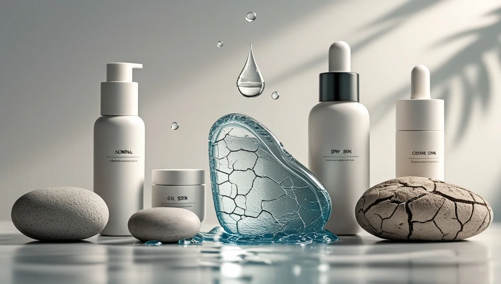

Hey there! Let's talk about something that's probably been on your mind but you might've been hesitant to ask about – your skin type. Trust me, I get it. When I first started exploring skincare, it felt like diving into a foreign language. But here's the thing: understanding your skin type is like having a roadmap to better skin, and it's simpler than you might think.

## Why Understanding Your Skin Type Matters

Picture this: You're standing in front of a wall of [skincare products](/blog/skincare-for-men/) at the store, feeling completely overwhelmed. Been there! The truth is, choosing the right products without knowing your skin type is like trying to build IKEA furniture without instructions – you might get there eventually, but you're probably going to make some frustrating mistakes along the way.

## The Main Types of Men's Skin

Let's break down the different skin types you might have. And yes, your skin type might be different from your buddy's – that's totally normal.

### Normal Skin
Think of normal skin as the "just right" porridge in Goldilocks. It's:
- Not too oily, not too dry
- Generally clear and smooth
- Small, barely visible pores
- Few to no imperfections
- Not particularly sensitive

If you can wash your face and forget about it for hours without any issues, you might have hit the skin-type jackpot!

### Dry Skin
You know that tight, uncomfortable feeling after washing your face? That's a classic dry skin signal. Signs include:
- Rough patches
- Visible flaking or peeling
- Feels tight, especially after cleansing
- More visible fine lines
- Might feel itchy or irritated

### Oily Skin
If you're constantly reaching for blotting papers or noticing a shine in every photo, welcome to the oily skin club. Characteristics include:
- Shiny or greasy appearance, especially by midday
- Enlarged or clearly visible pores
- Prone to blackheads and breakouts
- Thick or rough-feeling skin texture
- Makeup tends to slide off

### Combination Skin
Think of combination skin as having a split personality – but in a good way! You might have:
- Oily T-zone (forehead, nose, and chin)
- Dry or normal cheeks
- Different pore sizes across your face
- Occasional breakouts in oily areas
- Seasonal changes in skin behavior

### Sensitive Skin
The drama queen of skin types (no judgment – I've been there). Signs include:
- Easily becomes red or irritated
- Reacts quickly to new products
- Might sting or burn after product application
- Prone to rashes or bumps
- Can be aggravated by shaving

## How Men's Skin Differs from Women's

Let's clear something up: men's skin isn't just marketing – it's actually structurally different from women's skin. Here's why:

- **Thickness**: Men's skin is typically about 25% thicker
- **Collagen density**: Higher collagen levels mean slower aging (lucky us!)
- **Oil production**: Thanks to testosterone, we produce more sebum
- **Pore size**: Generally larger, which can mean more visible pores
- **Hair growth**: Facial hair means different skincare needs

<!--[Insert image: Microscopic comparison of male and female skin structure]-->

## Finding Your Skin Type: The Ultimate Test

Here's a foolproof way to determine your skin type (I call it the "Two-Hour Test"):

1. Wash your face with a gentle cleanser
2. Pat dry with a clean towel
3. Don't apply any products
4. Wait two hours
5. Observe your skin

Your results will tell you:
- **Tight and flaky**: Dry skin
- **Shiny all over**: Oily skin
- **Shiny T-zone, normal cheeks**: Combination skin
- **Comfortable, no significant changes**: Normal skin
- **Red, irritated, or uncomfortable**: Potentially sensitive skin

## Customizing Your Skincare Routine by Skin Type

Let's get down to business – here's what your routine should look like based on your skin type.

### Normal Skin Routine
Morning:
1. Gentle cleanser
2. Lightweight moisturizer
3. SPF 30+ sunscreen

Evening:
1. Cleanser
2. (Optional) treatment serum
3. Night moisturizer

**Product Recommendation**: The Jack Black Skin Saviors Set is perfect for normal skin types, providing everything you need in one package.

### Dry Skin Routine
Morning:
1. Cream cleanser
2. Hydrating serum
3. Rich moisturizer
4. SPF 30+ sunscreen

Evening:
1. Gentle cream cleanser
2. Hydrating serum
3. Heavy-duty night cream

**Product Recommendation**: Clinique For Men Starter Kit – Daily Intense Hydration is specifically formulated for dry skin needs.

### Oily Skin Routine
Morning:
1. Gel cleanser
2. Light, oil-free moisturizer
3. Mattifying SPF 30+ sunscreen

Evening:
1. Deep cleansing
2. (Optional) salicylic acid treatment
3. Light, oil-free moisturizer

**Product Recommendation**: Urban Skin Rx Men's Collection Kit works great for controlling excess oil.

### Combination Skin Routine
Morning:
1. Balanced cleanser
2. Zone-specific treatments
3. Light moisturizer
4. SPF 30+ sunscreen

Evening:
1. Thorough cleansing
2. Zone-specific treatments
3. Balanced moisturizer

**Product Recommendation**: Humanrace Skincare Routine Pack offers versatile products that work well for different facial zones.

### Sensitive Skin Routine
Morning:
1. Ultra-gentle cleanser
2. Calming serum
3. Fragrance-free moisturizer
4. Physical SPF 30+ sunscreen

Evening:
1. Gentle cleanser
2. Soothing treatment
3. Fragrance-free night cream

**Product Recommendation**: NIVEA MEN Sensitive Face Moisturiser SPF15 is specifically formulated for sensitive skin.

## The Impact of Lifestyle on Your Skin Type

Your skin type isn't just about genetics – it's also influenced by:

### Diet and Nutrition
- Water intake affects hydration levels
- High-sugar diets can increase oil production
- Omega-3 fatty acids support skin barrier function
- Antioxidant-rich foods fight skin damage

### Environmental Factors
- Climate changes can alter skin behavior
- Air conditioning and heating affect moisture levels
- Pollution can impact skin health
- UV exposure changes skin characteristics

### Exercise and Activity
- Sweating can help clear pores
- Post-workout cleansing is crucial
- Increased blood flow benefits skin health
- Proper hydration during exercise is essential

## Special Considerations for Men

### Facial Hair Management
Beard or no beard, your skincare routine needs to account for hair growth:
- Use beard oil to prevent dry skin underneath
- Consider how facial hair affects product application
- Address ingrown hairs appropriately
- Adapt cleansing techniques to work around facial hair

### Shaving Impact
Your shaving routine can significantly affect your skin:
- Always use sharp, clean razors
- Shave in the direction of hair growth
- Use appropriate shaving products for your skin type
- Consider post-shave treatments

## Seasonal Skin Type Changes

Your skin type isn't set in stone – it can change with the seasons:

### Summer Adjustments
- Lighter moisturizers
- Increased sun protection
- More frequent cleansing
- Oil-control products if needed

### Winter Modifications
- Richer moisturizers
- Gentle exfoliation
- Humidifier use
- Extra hydration steps

## Common Mistakes to Avoid

1. Over-washing your face
2. Using products not suited for your skin type
3. Skipping sunscreen
4. Ignoring skin changes
5. Using harsh products unnecessarily

## Building Your Skincare Arsenal

Essential products for every man, regardless of skin type:

1. Cleanser appropriate for your skin type
2. Moisturizer that matches your needs
3. Sunscreen (non-negotiable!)
4. Post-shave treatment
5. Weekly exfoliant

## When to See a Professional

Consider consulting a dermatologist if you experience:
- Persistent acne
- Unexplained skin changes
- Severe sensitivity
- Signs of premature aging
- Suspicious moles or spots

## The Future of Your Skin

Remember, your skin type can change over time due to:
- Age
- Hormonal changes
- Environmental factors
- Lifestyle modifications
- Health conditions

## Final Thoughts

Understanding your skin type is the first step toward better skin health. Start with the basics, pay attention to how your skin reacts, and don't be afraid to adjust your routine as needed. Remember, good skin isn't about having the most expensive products – it's about using the right products for your specific skin type and needs.

Ready to start your skincare journey? Take the time to identify your skin type using the two-hour test, then build your routine gradually. Your future self will thank you!