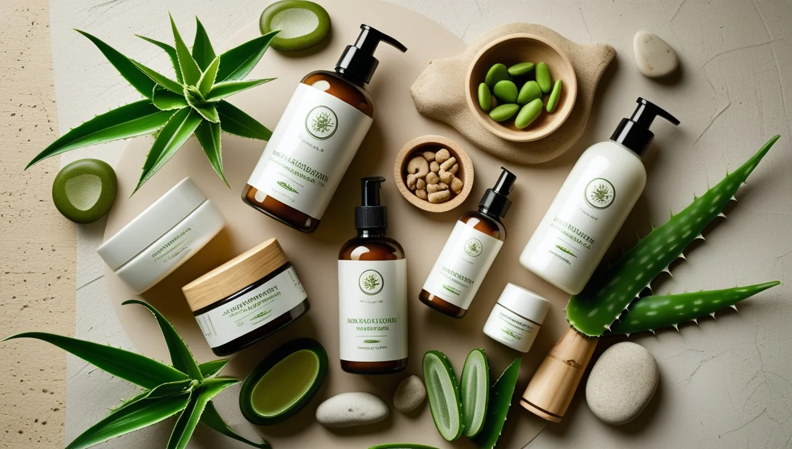

Look, I get it. Walking into a skincare store feels like entering a foreign country where everyone speaks a different language. As someone who spent years thinking a bar of soap and water was a complete "skincare routine," I've been exactly where you are. But here's the thing: taking care of your skin doesn't have to be complicated or intimidating, especially when you go the natural route.

## Why Natural Skincare? It's Not Just a Trend

Remember that friend who borrowed your generic drugstore face wash and broke out in a rash? That's exactly why we're having this conversation. Natural skincare isn't just another wellness trend – it's about understanding what you're actually putting on your face. Think of it as choosing whole foods over processed ones, but for your skin.

## The Natural Advantage: What Sets Natural Products Apart

Before we dive into specific products, let's talk about why natural skincare is worth your attention:

* **Gentle Yet Effective Performance**: Natural ingredients work with your skin rather than against it. Take tea tree oil, for instance – it fights acne without turning your face into a desert, unlike many harsh chemical alternatives I've tried (and regretted).

* **Long-term Skin Health**: You know how eating clean makes you feel better over time? Natural skincare works the same way. Instead of quick fixes that might harm your skin down the road, natural ingredients support your skin's health for the long haul.

* **Environmental Responsibility**: Let's face it – what we put on our skin eventually ends up in our waterways. By choosing natural products, you're not just taking care of yourself; you're also being mindful of the environment.

## Top 10 Natural Skincare Must-Haves for Men

### 1. Daily Cleanser: Rugged & Dapper Facial Cleanser

If there's one product that changed my skincare game, it's this one. Unlike that harsh soap you've been using, this cleanser combines aloe vera and green tea to remove dirt and oil without stripping your skin bare. Think of it as a reset button for your face – use it morning and night, and you'll notice the difference within weeks.

### 2. Moisturizer: Brickell Men's Daily Essential Face Moisturizer

"I don't need moisturizer – my skin is already oily," said every guy ever (including me, once upon a time). Here's the truth: proper hydration actually helps control oil production. This lightweight moisturizer absorbs quickly and won't leave you looking like you've just finished a marathon.

### 3. Facial Scrub: Acure Brightening Facial Scrub

Looking for that post-gym glow without the workout? This scrub is your secret weapon. Made with sea kelp and lemon peel, it removes dead skin cells and brightens your complexion. Use it twice a week – trust me, more isn't better when it comes to exfoliation.

### 4. Toner: Thayers Witch Hazel Toner

I know what you're thinking: "Another step?" But hear me out. This alcohol-free toner is like a sports drink for your face – it balances your skin's pH and preps it for whatever comes next. Plus, the witch hazel helps control oil and reduces inflammation.

### 5. Anti-Aging Treatment: Kiehl's Facial Fuel Energizing Moisture Treatment

Whether you're fighting aging signs or just want to maintain your youthful looks, this caffeine-infused moisturizer is like an espresso shot for your face. It reduces fine lines and gives your skin a firmer appearance – perfect for those mornings after late nights.

### 6. Natural Shaving Cream: The Art of Shaving Sandalwood Shaving Cream

Gone are the days of using whatever foam was on sale. This luxurious cream creates a protective barrier between your razor and skin, reducing those annoying red bumps and ingrown hairs. The sandalwood scent? That's just a bonus.

### 7. Post-Shave Balm: L'Occitane Cade After Shave Balm

If your post-shave routine consists of splashing on whatever's closest, it's time for an upgrade. This balm soothes irritated skin with shea butter and essential oils, making razor burn a thing of the past.

### 8. Spot Treatment: SheaMoisture African Black Soap

Breaking out before a big meeting? This natural soap, packed with plantain extract and shea butter, targets acne without drying out your skin. Use it as a spot treatment or all over – it's gentle enough for daily use.

### 9. Sun Protection: Neutrogena Men Triple Protect Face Lotion

Let's address the elephant in the room: yes, real men wear sunscreen. This multi-tasking lotion moisturizes while protecting your skin from UV damage. Think of it as armor against premature aging and skin cancer.

### 10. Treatment Mask: Herbivore Botanicals Blue Tansy Mask

Consider this your secret weapon for those times when your skin needs extra help. The blue tansy oil reduces redness and inflammation, while natural AHAs clear out clogged pores. Use it once a week, preferably when no one's around to see you in your blue-faced glory.

## Your Questions, Answered: FAQs About Natural Skincare

### "I have oily skin – won't natural products make it worse?"
Actually, the opposite is true. Many natural ingredients, like jojoba oil, mimic your skin's natural oils and can help regulate production. When you strip your skin with harsh chemicals, it often responds by producing more oil to compensate.

### "How long before I see results?"
Give it time, brother. Your skin cells turn over every 28 days, so allow at least a month to see significant changes. Some benefits, like better hydration, you'll notice within days.

### "What about acne-prone skin?"
Natural ingredients like tea tree oil, witch hazel, and African black soap are excellent for acne-prone skin. They fight bacteria without compromising your skin's natural barrier.

## Expert Tips for Maximum Results

1. **Layer in the Right Order**
Think of it like getting dressed – you wouldn't put your shirt on before your undershirt. Apply products from thinnest to thickest: toner, serum, moisturizer, sunscreen.

2. **Less Is More**
Start with a basic routine (cleanser, moisturizer, sunscreen) and add products gradually. This helps you identify what works and what doesn't.

3. **Read the Labels**
Just because something says "natural" doesn't mean it's good for your skin. Look for products with fewer ingredients and avoid synthetic fragrances.

4. **Consistency Is Key**
The best products won't work if you use them sporadically. Set reminders if you need to – your skin care routine should be as automatic as brushing your teeth.

## Seasonal Skincare Adjustments

### Summer
* Use lighter moisturizers
* Double down on SPF
* Consider adding a vitamin C serum for extra protection

### Winter
* Switch to a creamier moisturizer
* Don't skip sunscreen (yes, even in winter)
* Add a hydrating serum if needed

## Common Mistakes to Avoid

* **Over-exfoliating**: More isn't better. Stick to 1-2 times per week.
* **Skipping moisturizer**: Even oily skin needs hydration.
* **Using hot water**: Lukewarm is best – hot water strips your skin.
* **Touching your face**: Your 30-Day Natural Skincare Journey

Let's be real – changing your entire routine overnight is a recipe for disaster. Instead, here's a practical approach to transitioning to natural skincare:

**Week 1**: Replace your face wash with a natural cleanser
**Week 2**: Introduce a natural moisturizer
**Week 3**: Add sunscreen to your morning routine
**Week 4**: Incorporate additional treatments based on your specific needs

## The Bottom Line: Investing in Your Skin's Future

Think of natural skincare as a long-term investment in yourself. Just like you wouldn't expect immediate results from hitting the gym once, give your natural skincare routine time to work its magic. Start with the basics, pay attention to how your skin responds, and adjust accordingly.

Remember: the [best skincare](/blog/skincare-for-men/) routine is one you'll actually stick to. Whether you choose to incorporate all ten products or start with just the essentials, what matters is taking that first step toward better skin health.

Ready to transform your skincare routine? Start with one product and build from there. Your future self will thank you.