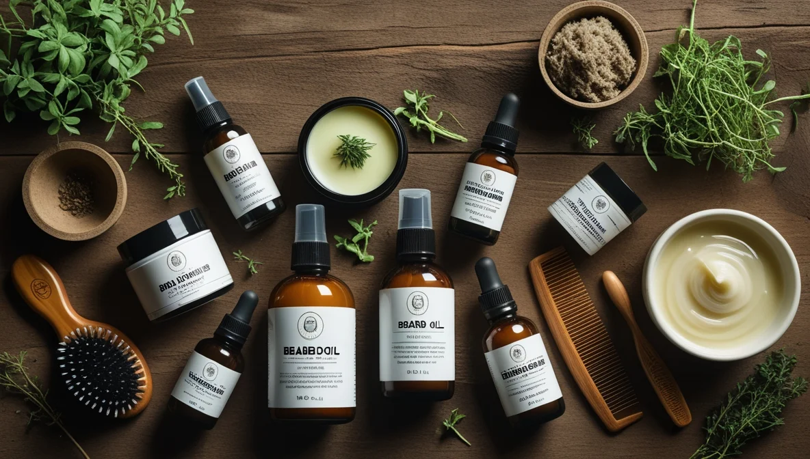

Picture this: You've spent months growing out that magnificent beard, but underneath it all, your skin is crying out for attention. If you're nodding along, you're not alone. As someone who's navigated the sometimes-tricky waters of beard care while maintaining healthy skin, I'm here to share everything I've learned about keeping both your facial hair and the skin beneath it in top condition.

## Understanding the Beard-Skin Connection

Here's something most guys don't realize: your beard and skin are in a constant relationship, and like any good relationship, both parties need attention to thrive. When you grow a beard, your skin underneath faces unique challenges - it can get dry, itchy, or even develop dandruff (yes, beard dandruff is a thing, and we'll tackle that later).

### Why Traditional Skincare Isn't Enough

Your regular face wash and moisturizer? They might not be cutting it anymore. Beards create a unique microenvironment on your face that requires special attention. Think of your beard as a forest - the denser it gets, the more challenging it becomes for products to reach the soil (your skin) beneath.

## The Foundation: Cleansing Your Beard and Skin

Let's start with the basics - keeping everything clean. But wait, can you use your regular face wash on your beard? Short answer: you could, but you shouldn't.

### Choosing the Right Cleanser

Your beard hair is different from the hair on your head and requires specific care. Here's what to look for in a beard wash:

- pH-balanced formulas that won't strip natural oils
- Ingredients that moisturize both hair and skin
- Gentle cleansers that won't cause irritation

**Top Product Pick:** Jack Black Beard Wash stands out here. It's gentle enough for daily use but tough enough to clean thoroughly. If you're looking for something more budget-friendly, Bulldog's Original Beard Shampoo gets the job done well.

### The Right Way to Wash

Here's my tried-and-true method for washing your beard:

1. Wet your beard thoroughly with warm water
2. Apply a small amount of beard wash
3. Massage gently into the skin beneath your beard
4. Work the product through your beard from roots to tips
5. Rinse thoroughly with warm water, followed by a cool water splash

**Pro tip:** Wash your beard 2-3 times a week. Over-washing can strip natural oils and lead to dryness.

## Moisturizing: The Key to Comfort

The number one complaint I hear from bearded guys? Dry, itchy skin underneath. Let's fix that.

### The Two-Layer Approach

Think of moisturizing with a beard like painting a wall behind a bookshelf - you need to reach the wall (your skin) before decorating the shelf (your beard). Here's how:

1. **Layer 1 - Skin Moisturizer**
   - Use a light, non-greasy moisturizer
   - Apply directly to the skin, massaging through beard hair
   - Look for products with hyaluronic acid for deep hydration

2. **Layer 2 - Beard Oil or Balm**
   - Apply beard oil when beard is slightly damp
   - Focus on even distribution
   - Use beard balm for additional styling and control

**Product Recommendations:**
- For Skin: Cardon Purifying Clay Cleanser
- For Beard: King C. Gillette Beard Oil or Bulldog Original Beard Balm

### The Great Debate: Oil vs. Balm

Here's a quick comparison to help you choose:

| Feature | Beard Oil | Beard Balm |
|---------|-----------|------------|
| Texture | Liquid | Solid/Waxy |
| Best For | Daily moisturizing | Styling & Control |
| Absorption | Quick | Gradual |
| Travel-Friendly | Less | More |
| Application | Dropper/Hands | Hands |

## Exfoliation: The Secret Weapon

Yes, you can (and should) exfoliate with a beard! But there's a right way to do it.

### How to Exfoliate with a Beard

1. Use a gentle facial scrub or chemical exfoliant
2. Apply carefully, working around beard hair
3. Focus on exposed skin and beard line
4. Limit to once or twice a week

**Pro tip:** A soft beard brush can help exfoliate the skin naturally while distributing oils through your beard.

## Sun Protection: Don't Skip the SPF

Your beard provides some natural [sun protection](/blog/skincare-for-men/), but it's not enough. Here's how to apply sunscreen with a beard:

1. Use a liquid or gel sunscreen
2. Apply to skin first, before beard products
3. Pay extra attention to exposed areas
4. Reapply throughout the day

**Recommended Products:**
- Prose Custom Beard Oil (with UV protection)
- Any lightweight, non-greasy facial sunscreen

## Dealing with Common Issues

### Beard Dandruff (Beardruff)

This common issue has simple solutions:
- Regular cleansing
- Proper moisturizing
- Anti-fungal treatments if needed
- Regular brushing to distribute oils

### Preventing Ingrown Hairs

Stop ingrown hairs before they start:
- Regular exfoliation
- Proper trimming technique
- Keep skin and beard moisturized
- Use sharp, clean tools

## The Ultimate Daily Routine

Morning:
1. Cleanse with beard wash (if scheduled)
2. Apply face moisturizer
3. Add beard oil
4. Style with balm if needed
5. Apply sunscreen

Evening:
1. Gentle cleanse
2. Exfoliate (if scheduled)
3. Moisturize skin
4. Apply beard oil
5. Brush beard to distribute products

## Treatment Masks and Deep Conditioning

Don't let your beard stop you from using face masks! Here's how:
- Apply mask to skin using fingertips
- Work carefully around beard hair
- Focus on exposed skin
- Use beard-specific masks monthly

**Try This:** Mix your regular face mask with a bit of beard oil for a custom treatment.

## Choosing the Right Tools

Your beard care arsenal should include:
- Quality beard brush
- Wide-toothed comb
- Sharp trimming scissors
- Electric trimmer
- Dedicated towel

**Top Pick:** The MoBros Personalised Beard Grooming Kit includes most essentials.

## Special Considerations

### For Sensitive Skin
- Use fragrance-free products
- Patch test new products
- Stick to gentle, natural ingredients

### For Coarse Hair
- Focus on softening products
- Deep condition regularly
- Use heavier beard oils

## When to See a Professional

Consider consulting a dermatologist or professional barber if you experience:
- Persistent irritation
- Patchy growth
- Severe dandruff
- Skin reactions to products

## Your Beard Care Shopping List

Essential Products:
1. Dedicated beard wash
2. Gentle face moisturizer
3. Quality beard oil
4. Beard brush and comb
5. Trimming tools
6. Sunscreen

Optional but Beneficial:
1. Beard balm
2. Exfoliating product
3. Treatment masks
4. Travel-size products

## The Bottom Line

Taking care of your beard and the skin beneath it doesn't have to be complicated. Start with the basics - cleansing, moisturizing, and protecting - and build from there. Remember, everyone's beard and skin are different, so don't be afraid to experiment with products and techniques until you find what works for you.

### Ready to Step Up Your Beard Game?

Start with one change at a time. Maybe it's investing in a quality beard oil or starting a proper cleansing routine. Whatever you choose, your beard (and the skin beneath it) will thank you.

<!--[Insert final image: Before/after comparison of a well-maintained beard and skin]-->

*Remember: A great beard starts with healthy skin. Take care of both, and you'll be well on your way to beard perfection.*